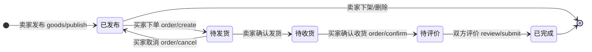
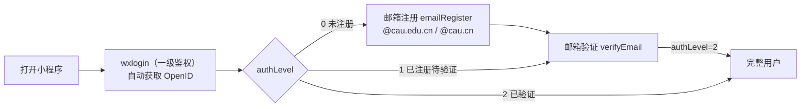

# Ueyo（有哟）校园二手交易平台

> 一个基于微信小程序 + 微信云开发的校园二手交易平台，支持商品买卖、悬赏求购、社区论坛、信用评价与即时消息。


---

## 目录

- [项目简介](#项目简介)
- [功能特性](#功能特性)
- [技术栈](#技术栈)
- [项目结构](#项目结构)
- [核心业务流程](#核心业务流程)
- [后端 API 清单](#后端-api-清单)
- [数据库设计](#数据库设计)
- [认证与鉴权](#认证与鉴权)
- [快速开始](#快速开始)
- [关键设计决策](#关键设计决策)
- [License](#license)

---

## 项目简介

**Ueyo（有哟）** 是面向高校校园场景的 C2C 二手交易平台。用户可以在平台上：

- 发布、浏览、下单、收藏闲置商品，并进行交易评价；
- 发布悬赏求购任务，其他用户可接单履约；
- 参与话题、帖子、回复组成的社区论坛；
- 通过内置即时消息与买家/卖家/接单人沟通；
- 使用**微信一键登录** + **校园邮箱注册/验证**完成实名认证，构建校园信用体系。

> ⚠️ 项目仍处于开发迭代阶段，部分页面与功能（如订单支付/退款、用户主页等）尚未完成或仍使用 mock 数据，详见各页面代码注释。

---

## 功能特性

| 模块 | 功能说明 |
| ---- | -------- |
| 🛒 商品交易 | 商品发布、分类浏览、关键词搜索、商品详情、收藏、下单、取消/确认收货、订单评价 |
| 🎁 悬赏求购 | 悬赏发布、悬赏列表/详情、接单、履约确认、双方评价 |
| 💬 社区论坛 | 话题创建、帖子发布、帖子详情、回复评论、话题下帖子聚合 |
| ⭐ 信用评价 | 交易完成后双方互评（评分 + 文字 + 图片），评分列表 |
| 📨 即时消息 | 会话列表、聊天消息、实时发送 |
| 👤 用户体系 | 微信登录、邮箱注册/验证、个人资料、收藏夹、我的发布/订单/悬赏 |
| ✨ AI 辅助 | 发布商品时通过 AI 服务自动生成商品描述 |

---

## 技术栈

- **前端**：微信小程序原生（WXML / WXSS / JavaScript），`glass-easel` 组件框架，自定义导航栏（`navigationStyle: custom`）
- **后端**：微信云开发（云函数 + 云数据库 + 云存储），`wx-server-sdk`
- **认证**：JWT（HS256）+ 微信 OpenID 双重鉴权
- **AI**：调用云托管 AI 服务生成商品描述（`aiClient.js`）

---

## 项目结构

```text
Ueyo/
├── project.config.json          # 微信开发者工具项目配置
├── project.private.config.json
├── AGENT.md                     # 项目分析与完成规划文档
├── docs/
│   └── architecture-diagram-prompts.md   # 架构图/业务流图 AI 提示词
├── cloudfunctions/
│   └── backend/                 # 后端云函数（单云函数 + 路由分发）
│       ├── index.js             # 入口：routeMap 路由分发（42 条路由）
│       ├── package.json
│       ├── constants/
│       │   ├── enums.js         # 商品/悬赏/订单状态、新旧程度枚举
│       │   ├── errors.js
│       │   └── response.js      # SUCCESS / ERROR 统一响应
│       ├── modules/             # 8 大业务模块（Controller → Service → Validator）
│       │   ├── goods/           # 商品：详情/列表/发布/AI描述/状态
│       │   ├── bounty/          # 悬赏：列表/详情/发布/接单/状态
│       │   ├── bounty_order/    # 悬赏订单：创建/列表/确认
│       │   ├── order/           # 订单：创建/列表/详情/取消/确认收货
│       │   ├── social/          # 社区：话题/帖子/回复
│       │   ├── review/          # 评价：提交/列表
│       │   ├── user/            # 用户：微信/邮箱登录/资料/收藏/活跃
│       │   └── message/         # 消息：会话/列表/发送
│       ├── shared/
│       │   ├── credit/          # 信用分服务
│       │   └── notification/    # 通知服务
│       └── utils/
│           ├── aiClient.js      # AI 描述生成客户端
│           ├── auth.js          # 鉴权中间件（一级/二级鉴权）
│           ├── helper.js        # catchAsync 异常包装 / 用户查询
│           ├── jwt.js           # JWT 签发与验证（HS256）
│           ├── openid.js
│           ├── price.js         # 价格工具（分/元转换）
│           └── validator.js
└── miniprogram/                 # 小程序前端
    ├── app.js                   # 全局：登录态管理、云环境初始化
    ├── app.json                 # 页面/窗口/tabBar 配置
    ├── app.wxss
    ├── components/              # 通用组件
    │   ├── tab-container/       # Tab 容器（含下拉刷新/上拉加载）
    │   ├── navigation-bar/      # 自定义导航栏
    │   ├── list/                # 商品/悬赏/推荐列表
    │   ├── comments/            # 评论组件
    │   ├── forums_detail/       # 话题/帖子/帖子集
    │   ├── order_detail/        # 订单状态卡片（商品×4 + 悬赏×3）
    │   └── publication_detail/  # 发布状态卡片（商品×4 + 悬赏×3）
    └── pages/
        ├── ueyo/                # 首页 Home / 商品详情 / 悬赏详情
        ├── index/               # 登录引导页
        ├── register_login/      # 注册 / 登录 / 邮箱验证
        ├── forums/              # 论坛集合 / 帖子详情 / 话题商品
        ├── add/                 # 发布中心：商品/悬赏/帖子/话题/选择
        ├── message/             # 会话列表 / 聊天详情
        └── self/                # 我的/设置/收藏/历史/订单/发布
```

### TabBar 五大入口

| Tab | 页面 | 说明 |
| --- | ---- | ---- |
| 有哟! | `pages/ueyo/Home/Home` | 首页：推荐 / 商品 / 悬赏 三 Tab |
| 论坛 | `pages/forums/Sets/Sets` | 话题与帖子聚合 |
| 添加 | `pages/add/Select/Select` | 发布中心入口 |
| 消息 | `pages/message/People/People` | 会话列表 |
| 我的 | `pages/self/Myself/Myself` | 个人中心 |

---

## 核心业务流程

### 商品交易状态机



| 阶段 | 卖家状态 `seller_status` | 买家状态 `buyer_status` |
| ---- | ----------------------- | ----------------------- |
| 已发布 | `1have_pub` | `none` |
| 待发货 | `2waited_for_del` | `1waited_for_pay`（待付款） |
| 待收货 | `2waited_for_del` | `2waited_for_get` |
| 待评价 | `3waited_for_dis` | `3waited_for_dis` |
| 已完成 | `4all_down` | `4have_down` |

### 悬赏求购状态机

| 阶段 | 发布者状态 `put_status` | 接单者状态 `get_status` |
| ---- | ----------------------- | ----------------------- |
| 已发布 | `1haven_pub` | `none` |
| 待履约 | `2waited_for_dis` | `1waited_for_do`（接单 `bounty_order/create`） |
| 待评价 | `2waited_for_dis` | `2waited_for_dis`（发布者确认 `bounty_order/confirm`） |
| 已完成 | `3all_down` | `3have_down` |

### 认证流程



---

## 后端 API 清单

云函数入口 `cloudfunctions/backend/index.js` 通过 `routeMap` 按 `event.action` 分发，共 **42 条路由**。统一响应格式：`{ code, msg, data, error, meta }`，`code === 0` 表示成功。

### 系统

| 路由 | 功能 |
| ---- | ---- |
| `test/ping` | 连通性测试 |

### 商品 `goods`

| 路由 | 功能 |
| ---- | ---- |
| `goods/list` | 商品列表（分页 / 分类 / 搜索） |
| `goods/detail` | 商品详情（含卖家信息与评论） |
| `goods/publish` | 发布商品 |
| `goods/generateDesc` | AI 生成商品描述 |
| `goods/updateStatus` | 更新商品状态 |

### 悬赏 `bounty`

| 路由 | 功能 |
| ---- | ---- |
| `bounty/list` | 悬赏列表（分页 / 分类） |
| `bounty/detail` | 悬赏详情 |
| `bounty/publish` | 发布悬赏 |
| `bounty/take` | 接取悬赏 |
| `bounty/updateStatus` | 更新悬赏状态 |

### 悬赏订单 `bounty_order`

| 路由 | 功能 |
| ---- | ---- |
| `bounty_order/create` | 创建悬赏订单（接单） |
| `bounty_order/list` | 悬赏订单列表（taker / putter） |
| `bounty_order/confirm` | 悬赏人确认完成 |

### 社区 `social`

| 路由 | 功能 |
| ---- | ---- |
| `social/topic/list` | 话题列表 |
| `social/post/list` | 帖子列表 |
| `social/topic/posts` | 话题下帖子 |
| `social/post/detail` | 帖子详情 |
| `social/post/publish` | 发布帖子 |
| `social/reply/submit` | 提交回复 |
| `social/topic/create` | 创建话题 |

### 评价 `review`

| 路由 | 功能 |
| ---- | ---- |
| `review/submit` | 提交评价（订单后互评） |
| `review/list` | 评价列表 |

### 用户 `user`

| 路由 | 功能 |
| ---- | ---- |
| `user/wxlogin` | 微信登录（一级鉴权） |
| `user/emailRegister` | 邮箱注册 |
| `user/verifyEmail` | 邮箱验证码验证 |
| `user/emailLogin` | 邮箱登录 |
| `user/profile` | 获取个人资料 |
| `user/updateProfile` | 更新个人资料 |
| `user/favorites` | 收藏列表 |
| `user/toggleFavorite` | 切换收藏 |
| `user/myGoods` | 我发布的商品 |
| `user/myBounties` | 我发布的悬赏 |
| `user/activity` | 用户活跃统计 |

### 订单 `order`

| 路由 | 功能 |
| ---- | ---- |
| `order/create` | 创建订单 |
| `order/list` | 订单列表（buyer / seller） |
| `order/detail` | 订单详情 |
| `order/cancel` | 取消订单 |
| `order/confirm` | 确认收货 |

### 消息 `message`

| 路由 | 功能 |
| ---- | ---- |
| `message/conversations` | 会话列表 |
| `message/list` | 聊天消息列表 |
| `message/send` | 发送消息 |

---

## 数据库设计

微信云数据库集合一览：

| 集合 | 用途 | 关键字段 |
| ---- | ---- | -------- |
| `users` | 用户 | `_openid, nickName, avatarUrl, cauEmail, authStatus, creditScore, favorites[], history[], publishedGoods[], publishedTasks[], getGood[], acceptTasks[]` |
| `goods` | 商品 | `title, price(分), originalPrice, condition, tradeType(文本), images, video, tags, seller_status, buyer_status, sellerInfo, relatedTopics` |
| `bounties` | 悬赏 | `title, expectedPrice(分), images, put_status, get_status, buyerInfo, takerInfo` |
| `orders` | 商品订单 | `orderNo, amount(分), tradeType, orderStatus, buyerInfo, sellerInfo, goodsSnapshot` |
| `bounties_order` | 悬赏订单 | `orderNo, amount(分), putterInfo, takerInfo, bountyInfo, bountySnapshot` |
| `topics` | 社区（三合一） | `type(1=话题/2=帖子/3=回复), title, content, images[], topicId, postId, authorInfo, detail_type` |
| `reviews` | 评价 | `rating, content, reviewerInfo, revieweeInfo, orderId` |
| `messages` | 会话摘要 | `participants[], lastContent, lastTime, unreadCount` |
| `messages_detail` | 消息详情 | `from, to, content, createdAt` |

---

## 认证与鉴权

采用**两级鉴权**体系（见 `cloudfunctions/backend/utils/auth.js`）：

| 级别 | 标识 | 说明 |
| ---- | ---- | ---- |
| 一级鉴权 | `event.OPENID` | 云函数自动注入微信 OpenID，保证请求来自真实微信用户 |
| 二级鉴权 | JWT `authLevel` | 标识用户邮箱注册/验证状态，`requireEmailAuth` 校验 |

**authLevel 说明：**

- `0` — 未注册（仅微信登录）
- `1` — 已注册邮箱，待验证
- `2` — 邮箱已验证（完整用户）

**JWT**（HS256）：载荷 `{ userId, openId, email, authLevel }`，默认有效期 7 天，通过请求参数 `data.__auth` 传递。

> 📌 开发阶段邮箱验证码统一为 `000000`；邮箱仅限农大域名 `@cau.edu.cn` / `@cau.cn`。

---

## 快速开始

### 1. 环境要求

- [微信开发者工具](https://developers.weixin.qq.com/miniprogram/dev/devtools/download.html)（最新稳定版）
- 一个已开通**云开发**的小程序 AppID（当前配置：`wxfaf55db3c6622b06`）
- Node.js（云函数本地开发调试用）

### 2. 导入项目

1. 打开微信开发者工具 → **导入项目**，选择仓库根目录；
2. `project.config.json` 已配置好 `miniprogramRoot`（`miniprogram/`）与 `cloudfunctionRoot`（`cloudfunctions/`），AppID 已填入，直接导入即可。

### 3. 开通云开发

1. 在开发者工具点击 **云开发** 按钮，开通云开发环境；
2. 若环境 ID 与 `miniprogram/app.js` 中不一致（当前为 `cloud1-d3gh09n2n6cba5219`），请替换为你的环境 ID；
3. 在云开发控制台创建以下集合：`users`、`goods`、`bounties`、`orders`、`bounties_order`、`topics`、`reviews`、`messages`、`messages_detail`。

### 4. 部署后端云函数

1. 在 `cloudfunctions/backend/` 目录右键 → **上传并部署：云端安装依赖**；
2. 部署完成后即可通过 `wx.cloud.callFunction({ name: 'backend', data: { action: 'xxx', data: {...} } })` 调用。

### 5. 配置 AI 服务（可选）

编辑 `cloudfunctions/backend/utils/aiClient.js`：

- `AI_SERVICE_URL` — 替换为实际部署的 AI 描述服务地址；
- `USE_MOCK` — 联调阶段可置 `true` 使用模拟文案，上线前置 `false`。

### 6. 运行

- 在开发者工具点击 **编译** 即可预览；
- 首次使用需完成微信授权登录，随后可按提示注册/验证农大邮箱。

---

## 关键设计决策

| 决策 | 说明 |
| ---- | ---- |
| `tradeType` 文本化 | 交易方式由枚举(1/2/3)改为用户自由输入的文本字符串 |
| `topics` 表三合一 | type=1 话题 / type=2 帖子 / type=3 回复，共用一张表 |
| 收藏存数组 | `favorites` 直接存于 `users` 文档数组（`goodsId[]`），非独立集合 |
| 价格存分 | 数据库 `price` / `expectedPrice` / `amount` 以分为单位（`*100`），前端展示时 `/100` |
| 状态字段拆分 | 商品拆分为 `seller_status` / `buyer_status`，悬赏拆分为 `put_status` / `get_status`，各自独立流转 |
| 金额字段名不统一 | `goods.price`、`bounties.expectedPrice`、`orders.amount` — 对接时需注意 |
| 单云函数路由分发 | 全部接口集中在 `backend` 一个云函数内，通过 `event.action` 路由，便于统一鉴权与日志 |

---

## License

本项目基于 [GPL-3.0](LICENSE) 开源协议发布。
