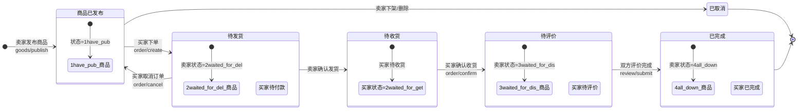
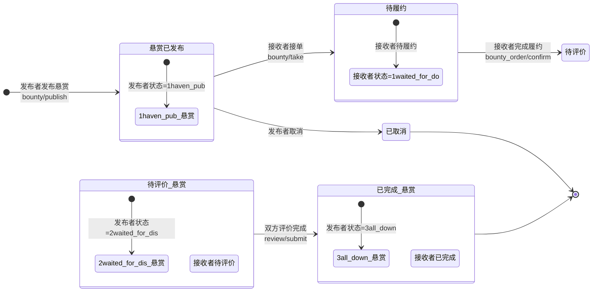
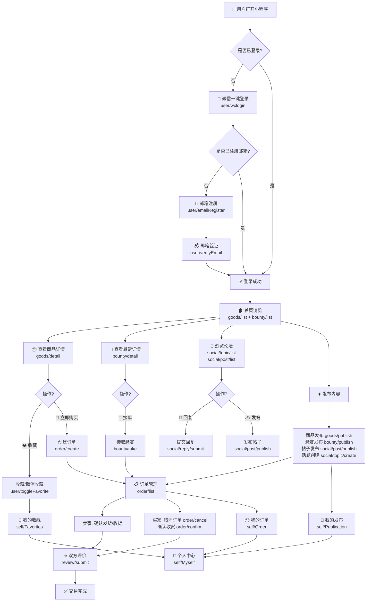
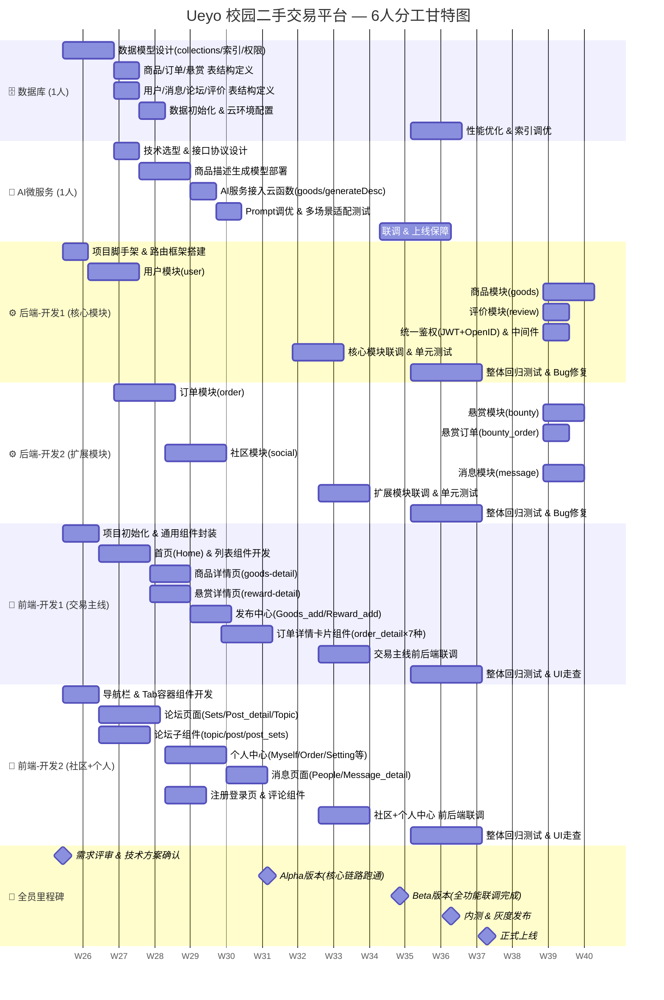
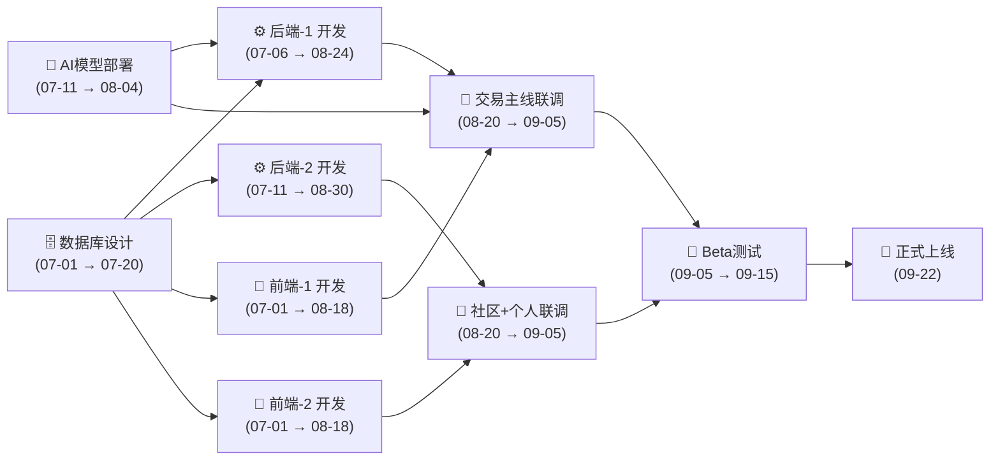

# Ueyo 校园二手交易平台 — AI 绘图提示代码

> 将下面的提示词分别粘贴到支持 Mermaid / Draw.io / PlantUML 的 AI 绘图工具中即可生成对应图表。
> 推荐工具：https://mermaid.live、VS Code + Mermaid 插件、Draw.io AI 模式。

---

## 一、层次架构图（Hierarchical Architecture Diagram）

### Mermaid 代码

```mermaid
graph TB
    subgraph 表现层["🖥️ 表现层 Presentation Layer"]
        direction LR
        A1["🏠 首页<br/>ueyo/Home"]
        A2["📦 商品详情<br/>goods-detail"]
        A3["🎁 悬赏详情<br/>reward-detail"]
        A4["💬 论坛<br/>forums/Sets<br/>forums/Post_detail<br/>forums/Topic_products"]
        A5["➕ 发布中心<br/>Goods_add/Reward_add<br/>Post_add/Topic_add"]
        A6["👤 个人中心<br/>Myself/Order/Setting<br/>Favorites/History/Publication"]
        A7["📨 消息<br/>People/Message_detail"]
        A8["🔐 注册登录<br/>UserLogin/UserRegister<br/>Email_Val"]
    end

    subgraph 组件层["🧩 通用组件层 Component Layer"]
        direction LR
        B1["tab-container<br/>tab-container-no-space"]
        B2["navigation-bar"]
        B3["goods-list / reward-list<br/>recommend-list"]
        B4["comments"]
        B5["order_detail<br/>(goods×4 + rewards×3)"]
        B6["publication_detail<br/>(goods×4 + rewards×3)"]
        B7["forums_detail<br/>(topic/post/post_sets)"]
    end

    subgraph 网关层["🌐 API 网关层 Gateway Layer"]
        C1["index.js 路由分发<br/>routeMap (31条路由)"]
        C2["JWT 鉴权<br/>utils/jwt.js"]
        C3["OpenID 校验<br/>utils/openid.js"]
        C4["统一响应<br/>SUCCESS / ERROR"]
    end

    subgraph 业务层["⚙️ 业务逻辑层 Business Logic Layer"]
        direction LR
        D1["goods<br/>controller → service → validator"]
        D2["bounty<br/>controller → service → validator"]
        D3["order<br/>controller → service → validator"]
        D4["bounty_order<br/>controller → service"]
        D5["social<br/>controller → service → validator"]
        D6["review<br/>controller → service → validator"]
        D7["user<br/>controller → service"]
        D8["message<br/>controller → service"]
    end

    subgraph 工具层["🔧 工具/基础设施层 Utility Layer"]
        direction LR
        E1["aiClient.js<br/>AI 描述生成"]
        E2["helper.js<br/>catchAsync 包装"]
        E3["price.js<br/>价格工具"]
        E4["validator.js<br/>通用校验"]
    end

    subgraph 数据层["💾 数据层 Data Layer"]
        direction LR
        F1["微信云数据库<br/>Cloud Database"]
        F2["微信云存储<br/>Cloud Storage"]
    end

    subgraph 外部服务["☁️ 外部服务 External"]
        G1["微信开放平台<br/>wx.login / openid"]
        G2["AI 描述服务<br/>ai-service.run.tcloudbase.com"]
        G3["邮件验证服务<br/>Email Verification"]
    end

    表现层 --> 组件层
    组件层 --> 网关层
    网关层 --> 业务层
    业务层 --> 工具层
    业务层 --> 数据层
    工具层 --> 外部服务
```



### 纯文本 AI 提示词（适用于 DALL·E / Midjourney / 通义万相等图片生成 AI）

```
请生成一张软件系统层次架构图。

这是一个名为"Ueyo"的微信小程序校园二手交易平台，采用微信云开发技术栈。

架构从上到下分为6层：

第1层【表现层】：微信小程序原生页面，包含首页(Home)、商品详情(goods-detail)、悬赏详情(reward-detail)、论坛(Sets/Post_detail/Topic_products)、发布中心(Goods_add/Reward_add/Post_add/Topic_add)、个人中心(Myself/Order/Setting/Favorites/History/Publication)、消息(People/Message_detail)、注册登录(UserLogin/UserRegister/Email_Val)。

第2层【通用组件层】：可复用小程序组件，包含 tab-container、navigation-bar、商品列表组件(goods-list/reward-list/recommend-list)、评论组件(comments)、订单详情卡片(order_detail: goods×4种状态 + rewards×3种状态)、发布详情卡片(publication_detail: goods×4 + rewards×3)、论坛详情组件(topic/post/post_sets)。

第3层【API网关层】：云函数入口 index.js 路由分发(31条路由)，包含 JWT 鉴权、OpenID 校验、统一响应格式(SUCCESS/ERROR)。

第4层【业务逻辑层】：8个业务模块，每个模块采用 Controller → Service → Validator 三层模式。模块包括：商品(goods)、悬赏(bounty)、订单(order)、悬赏订单(bounty_order)、社区(social)、评价(review)、用户(user)、消息(message)。

第5层【工具/基础设施层】：AI描述生成(aiClient.js)、异常包装(helper.js/catchAsync)、价格工具(price.js)、通用校验(validator.js)。

第6层【数据层】：微信云数据库(Cloud Database) + 微信云存储(Cloud Storage)。

外部服务：微信开放平台(wx.login/openid)、AI描述服务(ai-service)、邮件验证服务。

请用层次结构图展示，从上到下分层，使用中文标注，颜色区分各层，箭头表示依赖关系。
```

---

## 二、业务流转图（Business Flow Diagram）

### Mermaid 代码 — 商品交易完整流转



### Mermaid 代码 — 悬赏求购流转



### Mermaid 代码 — 用户核心业务流程



### 纯文本 AI 提示词（适用于图片生成 AI）

```
请生成一张电商平台业务流转图（泳道图或流程图形式）。

这是一个名为"Ueyo"的微信小程序校园二手交易平台，业务核心有两条主线：商品交易和悬赏求购。

【商品交易流转】
卖家发布商品(goods/publish) → 商品状态=已发布(1have_pub)
→ 买家下单(order/create) → 买家状态=待付款(1waited_for_pay)，卖家状态=待发货(2waited_for_del)
→ 卖家发货 → 买家状态=待收货(2waited_for_get)
→ 买家确认收货(order/confirm) → 买家状态=待评价(3waited_for_dis)，卖家状态=待评价(3waited_for_dis)
→ 双方评价(review/submit) → 买家状态=已完成(4have_down)，卖家状态=已完成(4all_down)
可中途取消：买家可取消未发货订单(order/cancel)

【悬赏求购流转】
发布者发布悬赏(bounty/publish) → 发布者状态=已发布(1haven_pub)
→ 接收者接单(bounty/take) → 接收者状态=待履约(1waited_for_do)
→ 接收者完成履约(bounty_order/confirm) → 发布者状态=待评价(2waited_for_dis)，接收者状态=待评价(2waited_for_dis)
→ 双方评价 → 发布者状态=已完成(3all_down)，接收者状态=已完成(3have_down)

【其他业务模块】
- 社区论坛：话题(topic) → 帖子(post) → 回复(reply)
- 用户系统：微信登录 → 邮箱注册 → 邮箱验证 → 个人资料管理
- 消息系统：会话列表 → 消息列表 → 发送消息
- AI 辅助：发布商品时调用 AI 生成商品描述(goods/generateDesc)

请用泳道图展示，泳道分为：买家/接收者、卖家/发布者、系统/平台。用不同颜色标记商品交易(蓝色系)和悬赏求购(橙色系)。标注关键 API 接口名称和状态枚举值。
```

---

## 三、6人分工甘特图（Gantt Chart）

> 团队配置：前端×2 + 后端×2 + AI微服务×1 + 数据库×1，项目周期 12 周。

### Mermaid 甘特图代码



### 工时汇总表格

| 角色        | 人员 | 主要职责                                       | 开始时间 | 结束时间 | 工期(天) |
| ----------- | ---- | ---------------------------------------------- | -------- | -------- | -------- |
| 🗄️ 数据库 | 1人  | 数据模型设计、表结构定义、索引优化、云环境配置 | 07-01    | 09-16    | 35d      |
| 🤖 AI微服务 | 1人  | 描述生成模型部署、接口联调、Prompt调优         | 07-11    | 09-22    | 39d      |
| ⚙️ 后端-1 | 1人  | 用户/商品/评价模块、鉴权中间件、核心链路       | 07-01    | 09-22    | 50d      |
| ⚙️ 后端-2 | 1人  | 订单/悬赏/社区/消息模块、扩展链路              | 07-11    | 09-22    | 49d      |
| 🎨 前端-1   | 1人  | 首页/详情/发布/订单(交易主线)、通用组件        | 07-01    | 09-22    | 50d      |
| 🎨 前端-2   | 1人  | 论坛/个人中心/消息/登录(社区+个人)             | 07-01    | 09-22    | 50d      |

### 关键里程碑

| 里程碑                     | 日期  | 交付标准                             |
| -------------------------- | ----- | ------------------------------------ |
| 🏁 需求评审 & 技术方案确认 | 07-01 | 原型图定稿、接口文档初版、数据库ER图 |
| 🔬 Alpha版本               | 08-10 | 商品发布→下单→评价 核心链路跑通    |
| 🧪 Beta版本                | 09-05 | 全模块前后端联调完成，AI服务接入     |
| 🚦 内测 & 灰度发布         | 09-15 | 内部测试通过，灰度10%用户            |
| 🚀 正式上线                | 09-22 | 全量发布，监控告警就位               |

### 依赖关系说明



### 纯文本 AI 提示词（适用于图片生成 AI）

```
请生成一张软件项目甘特图(项目管理时间线图)。

项目名称：Ueyo 校园二手交易平台
项目周期：2026年7月1日 至 2026年9月22日（共12周）
团队规模：6人

【6人分工与时间线】

角色1 - 数据库(1人)：
- 07-01至07-10：数据模型设计(collections/索引/权限)
- 07-11至07-20：商品/订单/悬赏/用户/消息/论坛表结构定义
- 07-21至07-25：数据初始化 & 云环境配置
- 09-07至09-16：性能优化 & 索引调优

角色2 - AI微服务(1人)：
- 07-11至07-15：技术选型 & 接口协议设计
- 07-16至07-30：商品描述生成模型部署
- 08-01至08-05：AI服务接入云函数(goods/generateDesc)
- 08-06至08-10：Prompt调优 & 多场景适配测试
- 09-01至09-22：联调 & 上线保障

角色3 - 后端开发1(核心模块)：
- 07-01至07-05：项目脚手架 & 路由框架搭建
- 07-06至07-20：用户模块(登录/注册/资料)
- 07-21至08-04：商品模块(CRUD+状态流转)
- 08-05至08-09：评价模块(提交/列表) + 统一鉴权中间件
- 08-15至08-24：核心模块联调 & 单元测试
- 09-07至09-22：回归测试 & Bug修复

角色4 - 后端开发2(扩展模块)：
- 07-11至07-25：订单模块(创建/支付/物流)
- 07-26至08-04：悬赏模块(发布/接单/履约)
- 08-05至08-09：悬赏订单模块(创建/确认)
- 07-21至08-04：社区模块(话题/帖子/回复)
- 08-05至08-14：消息模块(会话/发送/列表)
- 08-20至08-30：扩展模块联调 & 单元测试
- 09-07至09-22：回归测试 & Bug修复

角色5 - 前端开发1(交易主线)：
- 07-01至07-07：项目初始化 & 通用组件封装(tab-container/navigation-bar)
- 07-08至07-20：首页(Home) & 列表组件(goods-list/reward-list/recommend-list)
- 07-21至07-30：商品详情页 + 悬赏详情页
- 08-01至08-10：发布中心(Goods_add/Reward_add) + AI生成描述接入
- 08-01至08-15：订单详情卡片组件(order_detail 7种状态)
- 08-20至08-30：交易主线前后端联调
- 09-07至09-22：回归测试 & UI走查

角色6 - 前端开发2(社区+个人)：
- 07-01至07-07：导航栏 & Tab容器组件开发
- 07-08至07-20：论坛页面(Sets/Post_detail/Topic_products) + 论坛子组件
- 07-21至08-04：个人中心(Myself/Order/Setting/Favorites/History/Publication)
- 08-05至08-14：消息页面(People/Message_detail) + 评论组件
- 07-21至07-30：注册登录页(UserLogin/UserRegister/Email_Val)
- 08-20至08-30：社区+个人中心前后端联调
- 09-07至09-22：回归测试 & UI走查

【里程碑】
- 07-01：需求评审 & 技术方案确认
- 08-10：Alpha版本(核心链路跑通)
- 09-05：Beta版本(全功能联调完成)
- 09-15：内测 & 灰度发布
- 09-22：正式上线

请生成甘特图，用6种不同颜色区分6个角色，横轴为日期(周为单位)，纵轴为各角色任务。标注4个里程碑节点。
```

---

## 四、快速使用指南

| 图表类型       | 推荐方式     | 操作                                                                                   |
| -------------- | ------------ | -------------------------------------------------------------------------------------- |
| 层次架构图     | Mermaid Live | 复制「一」中的 mermaid 代码到 https://mermaid.live                                     |
| 商品状态流转图 | Mermaid Live | 复制「二」中的 stateDiagram 代码                                                       |
| 用户业务流程图 | Mermaid Live | 复制「二」中的 flowchart 代码                                                          |
| 综合业务泳道图 | AI 绘图工具  | 复制「二」中的纯文本提示词到 ChatGPT/Claude/通义千问，让其生成 Draw.io XML 或 PlantUML |
| 6人分工甘特图  | Mermaid Live | 复制「三」中的 mermaid gantt 代码到 https://mermaid.live                               |
| 甘特图图片版   | AI 绘图工具  | 复制「三」中的纯文本提示词到 ChatGPT/Claude/通义千问                                   |
| 美观架构图     | Draw.io + AI | 将纯文本提示词输入 Draw.io 的 AI 模式自动生成                                          |
